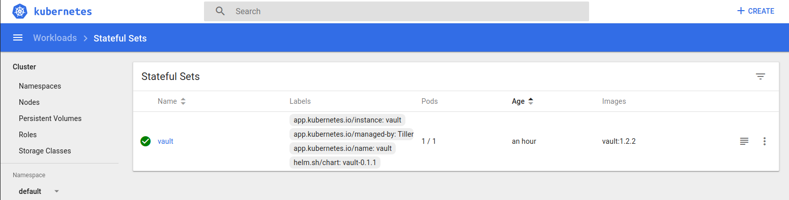
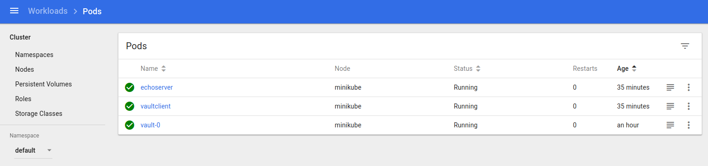
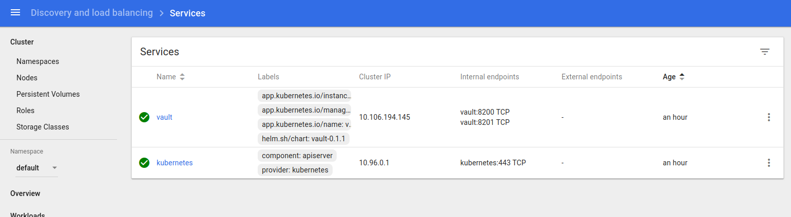

# Vault Kubernetes Auth with Minikube


Simple tutorial to setup a very basic Vault auth with Kubernetes.  The following sample will

1. Setup Vault on Minikube using a the [Vault Helm Chart](https://www.hashicorp.com/blog/announcing-the-vault-helm-chart)
2. Enable [Vault kubernetes auth plugin](https://www.vaultproject.io/docs/auth/kubernetes.html)
3. Define a [Vault policy](https://www.vaultproject.io/docs/concepts/policies.html) bound to a Kubernetes Service Account
4. Deploy an application Pod tied to a that Kubernetes Service Account
5. Exchange the application Pod's service account JWT token for a `VAULT_TOKEN`.


This tutorial is very basic and just setups a simple configuration. For anything else, please see [Vault Agent with Kubernetes](https://learn.hashicorp.com/vault/developer/vault-agent-k8s) and the blog ["Announcing First-Class Kubernetes Support for HashiCorp Products"](https://www.hashicorp.com/blog/first-class-kubernetes-support-for-hashicorp-products).


### Setup

You'll need on your local system:

* [Minikube](https://kubernetes.io/docs/tasks/tools/install-minikube/)
* [kubectl](https://kubernetes.io/docs/tasks/tools/install-kubectl/)
* [helm](https://helm.sh/)
* [Vault](https://www.vaultproject.io/downloads.html)


#### Start Minikube and Install Vault

```bash
minikube start
minikube dashboard

https://www.vaultproject.io/docs/platform/k8s/run.html#installing-vault
git clone https://github.com/hashicorp/vault-helm.git
cd vault-helm
git checkout v0.1.2
helm init
# Wait for `tiller-deployment`
# kubectl get deployment -n kube-system

helm install --name=vault --set='server.dev.enabled=true' .
```

#### Check Vault Status

```bash
$ kubectl get statefulset,po
NAME                     READY   AGE
statefulset.apps/vault   1/1     29s

NAME          READY   STATUS    RESTARTS   AGE
pod/vault-0   1/1     Running   0          29s

$ kubectl exec -it vault-0 -- vault status
Key             Value
---             -----
Seal Type       shamir
Initialized     true
Sealed          false
Total Shares    1
Threshold       1
Version         1.2.2
Cluster Name    vault-cluster-6ecc74d7
Cluster ID      9dcc3b81-8939-cdbf-66d8-04a5ed454129
HA Enabled      false
```

The root Token in `--dev` mode here is "root"

```
$ kubectl logs vault-0

Unseal Key: Ndy4bIyqTNYyuPjxU16AB0ILMv7ZkpgshrfhGPINw6I=
Root Token: root
```

#### Configure Vault

In a *new* window, create a tunnel to the Vault pod and export the required ENV vars

```bash
$ kubectl port-forward vault-0 8200:8200 & 

$ export VAULT_TOKEN=root
$ export VAULT_ADDR='http://localhost:8200'
```

- Check Status of vault connectivity

```bash
$ vault status

Key             Value
---             -----
Seal Type       shamir
Initialized     true
Sealed          false
Total Shares    1
Threshold       1
Version         1.2.2
Cluster Name    vault-cluster-6ecc74d7
Cluster ID      9dcc3b81-8939-cdbf-66d8-04a5ed454129
HA Enabled      false
```

Check if vault Service Accounts are created

```bash
$  kubectl get secrets,serviceaccounts
NAME                         TYPE                                  DATA   AGE
secret/default-token-qc6cs   kubernetes.io/service-account-token   3      54m
secret/vault-token-ghg9n     kubernetes.io/service-account-token   3      25m

NAME                     SECRETS   AGE
serviceaccount/default   1         54m
serviceaccount/vault     1         25m
```

#### Create Cluster binding for Vault to tokenreview

This will allow Vault's Service account (`serviceaccount/vault `) permissions to check authorizations:

`system:auth-delegator`: _Allows delegated authentication and authorization checks. This is commonly used by add-on API servers for unified authentication and authorization._

```bash
cat <<EOF > vault-auth-service-account.yaml
apiVersion: rbac.authorization.k8s.io/v1beta1
kind: ClusterRoleBinding
metadata:
  name: role-tokenreview-binding
  namespace: default
roleRef:
  apiGroup: rbac.authorization.k8s.io
  kind: ClusterRole
  name: system:auth-delegator
subjects:
- kind: ServiceAccount
  name: vault
  namespace: default
EOF

kubectl apply -f vault-auth-service-account.yaml
```


#### Create ServiceAccounts for application Pods:

We are creating two ServiceAccounts here

- `vault-auth`: This service account will run in a POD that will have access to Vault
- `pod-auth`:  This is just a test ServiceAccount that is bound to a kubernetes Role that allows list access to Pods


```bash
cat <<EOF > role-binding.yaml 
apiVersion: v1
kind: ServiceAccount
metadata:
  name: vault-auth
  namespace: default
---
apiVersion: v1
kind: ServiceAccount
metadata:
  name: pod-robot
  namespace: default
automountServiceAccountToken: false
---
apiVersion: rbac.authorization.k8s.io/v1
kind: RoleBinding
metadata:
  name: role-pod-reader-binding
  namespace: default
roleRef:
  apiGroup: rbac.authorization.k8s.io
  kind: Role
  name: pod-reader-role
subjects:
- kind: ServiceAccount
  name: pod-robot
---
kind: Role
apiVersion: rbac.authorization.k8s.io/v1
metadata:
  namespace: default
  name: pod-reader-role
rules:
- apiGroups: [""] 
  resources: ["pods"]
  verbs: ["list"]
EOF


kubectl apply -f role-binding.yaml 
```


Now create the Pods that will have these ServiceAccounts bound to them.

```bash
cat <<EOF > pod.yaml 
apiVersion: v1
kind: Pod
metadata:
  name: echoserver
spec:
  containers:
  - image: k8s.gcr.io/echoserver:1.10
    name: echoserver
    env:
      - name: MY_POD_SERVICE_ACCOUNT
        valueFrom:
          fieldRef:
            fieldPath: spec.serviceAccountName
  serviceAccountName: pod-robot
  automountServiceAccountToken: true
---
apiVersion: v1
kind: Pod
metadata:
  name: vaultclient
spec:
  containers:
  - image: k8s.gcr.io/echoserver:1.10
    name: vaultclient
  serviceAccountName: vault-auth
  automountServiceAccountToken: true
EOF


kubectl apply -f pod.yaml 
```

####  Bootstrap Vault auth for Kubernetes

Enable Vault Kubernetes auth configure with the kubernetes master.  Specify the ServiceAccount JWT to use to
authenticate itself to the master (in our case, its the `vault` Kubernetes Service account we setup earler)

```bash
export VAULT_SA_NAME=$(kubectl get sa vault -o jsonpath="{.secrets[*]['name']}")
export SA_JWT_TOKEN=$(kubectl get secret $VAULT_SA_NAME -o jsonpath="{.data.token}" | base64 --decode; echo)
export SA_CA_CRT=$(kubectl get secret $VAULT_SA_NAME -o jsonpath="{.data['ca\.crt']}" | base64 --decode; echo)
export K8S_HOST=$(minikube ip)

echo $VAULT_SA_NAME
echo $SA_JWT_TOKEN
echo $SA_CA_CRT
echo $K8S_HOST
```

Now enable the kv secret and kubernetes auth and bootstrap its config

```bash
vault secrets enable -version=2  -path=kv kv
vault auth enable kubernetes

vault write auth/kubernetes/config \
        token_reviewer_jwt="$SA_JWT_TOKEN" \
        kubernetes_host="https://$K8S_HOST:8443" \
        kubernetes_ca_cert="$SA_CA_CRT"
```

At this point, Vault is configured to understand and process a JWT provided to it that represents any _other_ kubernetes service account.  The other service account in this case will be the `vault-auth` service account we specified earlier.

####   Configure Vault policies to read a kv secret

Configure an arbitrary `kv` endpoint for testing in vault

```bash
cat <<EOF > myapp-kv-ro.hcl
path "kv" {                                                                                                                                                 
    capabilities = ["list"]                                                                                                                                  
}                                                                                                                                                            
                                                                                                                                                             
path "kv/data/message" {
    capabilities = ["create", "update", "delete", "list", "read"]
}
EOF
```

Then bind the policy to the `auth/kubernetes/role/example` such that it will accept a JWT for `vault-auth` and return a policy for `myapp-kv-ro`

```bash
vault policy write myapp-kv-ro  myapp-kv-ro.hcl

vault write auth/kubernetes/role/example \
        bound_service_account_names=vault-auth \
        bound_service_account_namespaces=default \
        policies=myapp-kv-ro \
        ttl=24h
```


#### Test Vault Auth for Kubernetes

First make sure everythinhg is running
```bash
kubectl get po,roles,rolebinding,deployments,serviceaccounts,secrets
NAME              READY   STATUS    RESTARTS   AGE
pod/echoserver    1/1     Running   0          27m
pod/vault-0       1/1     Running   0          69m
pod/vaultclient   1/1     Running   0          27m

NAME                                             AGE
role.rbac.authorization.k8s.io/pod-reader-role   27m

NAME                                                            AGE
rolebinding.rbac.authorization.k8s.io/role-pod-reader-binding   27m

NAME                        SECRETS   AGE
serviceaccount/default      1         99m
serviceaccount/pod-robot    1         27m
serviceaccount/vault        1         69m
serviceaccount/vault-auth   1         27m

NAME                            TYPE                                  DATA   AGE
secret/default-token-qc6cs      kubernetes.io/service-account-token   3      99m
secret/pod-robot-token-zckrp    kubernetes.io/service-account-token   3      27m
secret/vault-auth-token-9qlsf   kubernetes.io/service-account-token   3      27m
secret/vault-token-ghg9n        kubernetes.io/service-account-token   3      69m
```


- `statefulset` 


- `pods` 


- `services` 


- `statefulset` 


Now acquire a shell to the `vaultclient` pod

```
kubectl exec -it vaultclient -- /bin/bash
```

Install a utility and get the serviceAccount bound to this pod

```bash
apt-get update && apt-get install jq -y
export TOKEN=$(cat /var/run/secrets/kubernetes.io/serviceaccount/token)
```

Decode the token at [jwt.io](jwt.io) to see

```json
{
  "alg": "RS256",
  "kid": ""
}.
{
  "iss": "kubernetes/serviceaccount",
  "kubernetes.io/serviceaccount/namespace": "default",
  "kubernetes.io/serviceaccount/secret.name": "vault-auth-token-9qlsf",
  "kubernetes.io/serviceaccount/service-account.name": "vault-auth",
  "kubernetes.io/serviceaccount/service-account.uid": "a232e082-de67-11e9-9174-e89a62c2a346",
  "sub": "system:serviceaccount:default:vault-auth"
}
```

Then use it to call the vault service

```bash
curl  -s  --request POST  \
     --data "{\"jwt\": \"$TOKEN\", \"role\": \"example\"}"  \
     http://vault:8200/v1/auth/kubernetes/login | jq '.' 
```
should give:

```json
{
  "request_id": "30fc837f-a7c3-64e2-c916-885d343fb9ab",
  "lease_id": "",
  "renewable": false,
  "lease_duration": 0,
  "data": null,
  "wrap_info": null,
  "warnings": null,
  "auth": {
    "client_token": "s.aZ4OqO756iocvGNWGtMlM0FK",
    "accessor": "MsENzypoKt8lxSbVq4cKA0rS",
    "policies": [
      "default",
      "myapp-kv-ro"
    ],
    "token_policies": [
      "default",
      "myapp-kv-ro"
    ],
    "metadata": {
      "role": "example",
      "service_account_name": "vault-auth",
      "service_account_namespace": "default",
      "service_account_secret_name": "vault-auth-token-9qlsf",
      "service_account_uid": "a232e082-de67-11e9-9174-e89a62c2a346"
    },
    "lease_duration": 86400,
    "renewable": true,
    "entity_id": "a8d0b397-1d8d-d992-8985-b768613fe88f",
    "token_type": "service",
    "orphan": true
  }
}
```

Notice that we just returned a Vault token givne a kubernetes token. 

#### Test VAULT_TOKEN 

In a *new* window, export the token and attempt to use it with the kv service

```bash
export VAULT_ADDR='http://localhost:8200'
export VAULT_TOKEN=s.aZ4OqO756iocvGNWGtMlM0FK

$ vault kv put kv/message foo=world
Key              Value
---              -----
created_time     2019-09-24T01:47:27.389037577Z
deletion_time    n/a
destroyed        false
version          1


$ vault kv get kv/message
====== Metadata ======
Key              Value
---              -----
created_time     2019-09-24T01:47:27.389037577Z
deletion_time    n/a
destroyed        false
version          1

=== Data ===
Key    Value
---    -----
foo    world
```


#### Test Regular k8s SA Access

This step is entirely optional and not even related to Vault.  All we re doing here is [accessing the k8s api from a POD](https://kubernetes.io/docs/tasks/administer-cluster/access-cluster-api/).  SPecifically, we've granted a pod `echoserver` a serviceAccount `pod-robot` the ability to list pods

In a new window, exec to the `echoserver` pod and invoke the k8s API server

```
 kubectl exec -it echoserver -- /bin/bash

curl -v --cacert /var/run/secrets/kubernetes.io/serviceaccount/ca.crt -H "Authorization: Bearer $(cat /var/run/secrets/kubernetes.io/serviceaccount/token)" https://kubernetes.default.svc/api/v1/namespaces/default/pods
```
 
If you attempt to recall any other resource, you'll see an error (thats expected!)


### References

If you are interested in Vault integration to GCP (just secrets and auth), see [Vault auth and secrets on GCP](https://github.com/salrashid123/vault_gcp).